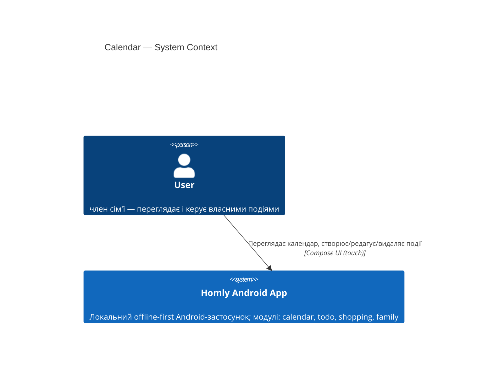

# Software Architecture Document — calendar (Events)

<!-- Stages 04-05 → see sdlc/plugin/skills/architecture-design/SKILL.md -->
<!-- 12 Arc42 sections. Empty sections — <!-- N/A: <one-line reason> -->. -->
<!-- C4 Context (L1) lives inline in §3. C4 Container (L2) lives inline in §5. -->

## 1. Introduction and goals

**Intent.** Модуль calendar дозволяє кожному члену сім'ї створювати timed та all-day події і переглядати їх у місячному calendar-view із щоденним списком подій. У поточній ітерації події прив'язані до конкретного `user` (per-user); спільний сімейний доступ — у наступній фазі (family-модуль). Модуль є одним із чотирьох рівноцінних модулів прототипу (events, todo, shopping, family). *(PRD §2, §1, idea-brief §7)*

**Top-3 quality goals (1-liners; full scenarios in §10):**

1. **Data isolation** — кожен запит до сховища фільтрує події виключно за `userId` авторизованого користувача; жодне поле іншого користувача не повертається *(PRD §6.1, AC-10)*
2. **Domain integrity** — всі domain-invariants (MAX_EVENTS=100, endTime > startTime, title непорожній і ≤100 символів) перевіряються у domain-шарі до будь-якого запису *(PRD §8, AC-07, AC-07b, AC-08, AC-09)*
3. **Calendar correctness** — після вибору дня all-day події відображаються першими, timed — відсортовані за startTime ascending *(AC-01, AC-03, AC-04)*

**Stakeholders.**

| Role | Interest | Sign-off owner? |
|---|---|---|
| user | створює і переглядає власні події | No |
| Tech Lead | review SAD + code | Yes |
| Security Lead | review data-isolation + injection risks | No |

## 2. Constraints

**Technical.**
- Kotlin 2.2.10 + Coroutines
- Android SDK: Min 24 (Android 7.0) / Target+Compile 36 (Android 15)
- AGP 9.2.1 · KSP 2.2.10-2.0.2
- Jetpack Compose BOM 2026.02.01 + Material3
- Room 2.7.1 (KSP-generated DAOs) — HomlyDatabase version 3→**4** (нова таблиця `calendar_events`)
- Navigation Compose 2.9.0
- DataStore Preferences 1.1.4 (сесія/userId)
- Без DI-фреймворку — manual wiring через `AppContainer` (`HomlyApplication.kt`)

**Organisational.**
- Effort: ~1 person-week (solo, Alex)
- Prototype — NFRs deferred; немає Production SLA

**Conventions.**
- CLAUDE.md: Kotlin official code style, 4-space indent, один Composable-екран = один файл
- ARCHITECTURE.md: feature/presentation/domain/data layout; MVVM + StateFlow; Compose-only (no XML)
- Усі нові залежності — через `gradle/libs.versions.toml`

**Regulatory / external.**
- Дані класифіковані як internal (PRD §6.1): event title може містити особисту інформацію (медичні записи)
- Без нових auth-меж; Room parameterized queries запобігають SQL injection
- Локальна БД — без мережі, без cloud sync у цій ітерації

## 3. Context and scope

<!-- brownfield: calendar package is new; app shell (auth, todo, shopping) already exists -->

Модуль calendar — частина локального Android-застосунку Homly. User переглядає місячний grid, обирає день, бачить список подій дня, і може створювати / редагувати / видаляти власні timed або all-day події. У цій ітерації немає зовнішніх систем: немає backend-сервера, push-сервісу, синхронізації з Google Calendar — застосунок повністю offline-first.

**External systems (in / out):**

| Actor or system | Type | Interaction |
|---|---|---|
| user | Person (internal) | Переглядає і редагує власні події через Compose UI |

*(Жодних зовнішніх систем у цій ітерації — PRD §3 Non-goals)*

**C4 Context (L1):**

## 4. Solution strategy

**SC-1: Follow existing MVVM feature module pattern** — нова папка `calendar/` зі стандартним layout `presentation/domain/data`, manual wiring через `AppContainer`. Відхилення не потрібне: idea-brief §8 фіксує «events структурно ідентичні todo+shopping плюс datetime-поля». *(inline — конвенція ARCHITECTURE.md)*

**SC-2: Розширити `HomlyDatabase` з явною Migration(3→4)** — таблиця `calendar_events` додається до єдиної Room-бази; version bump 3→4 через `Migration(3, 4)` з `CREATE TABLE`. Альтернатива `fallbackToDestructiveMigration` відхилена — втрата todo/shopping-даних неприйнятна навіть для прототипу. *(→ ADR-0001)*

**SC-3: Enforce per-user filtering at DAO level** — кожен DAO-метод на читання містить `WHERE userId = :userId`. Defense in depth: security-invariant не залежить від коректності use-case. Узгоджено з паттерном `TodoItemEntity`/`ShoppingItemEntity`. *(→ ADR-0002)*

## 5. Building block view

<!-- TBD — Socratic pass §5 -->

## 6. Runtime view

<!-- TBD — Socratic pass §6 -->

## 7. Deployment view

<!-- TBD — Socratic pass §7 -->

## 8. Crosscutting concepts

<!-- TBD — Socratic pass §8 -->

## 9. Architecture decisions

<!-- TBD — auto-populated during Socratic pass as ADRs spawn -->

| # | Title | Status | Section |
|---|---|---|---|
| 0001 | Use proper Room Migration for calendar_events schema change | Accepted | §4 |
| 0002 | Enforce per-user event filtering at DAO level | Accepted | §4 |

## 10. Quality requirements

<!-- TBD — Socratic pass §10 -->

## 11. Risks and technical debt

<!-- TBD — Socratic pass §11 -->

| Risk / debt | Severity | Mitigation | Owner |
|---|---|---|---|

**Accepted debt (acceptable in v1, plan to fix later):**

## 12. Glossary

<!-- TBD — auto-extract during Socratic pass -->
