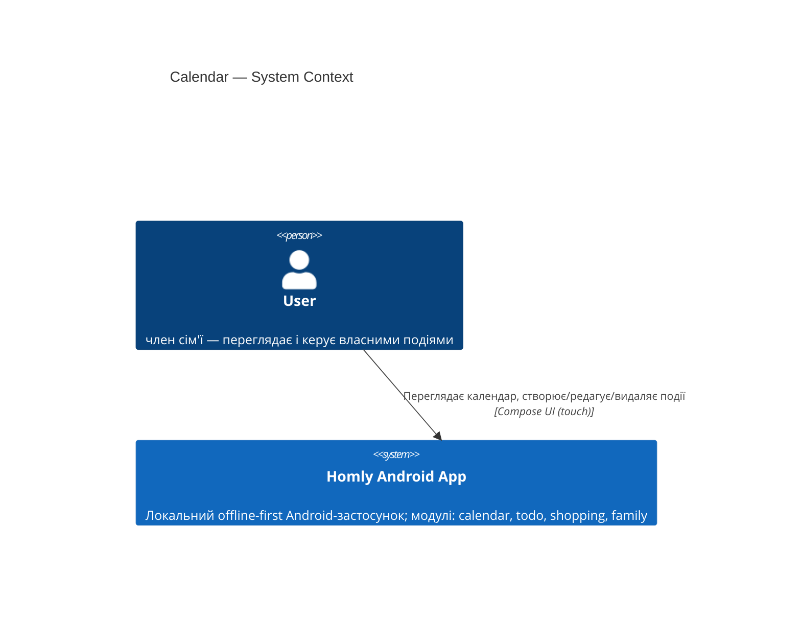
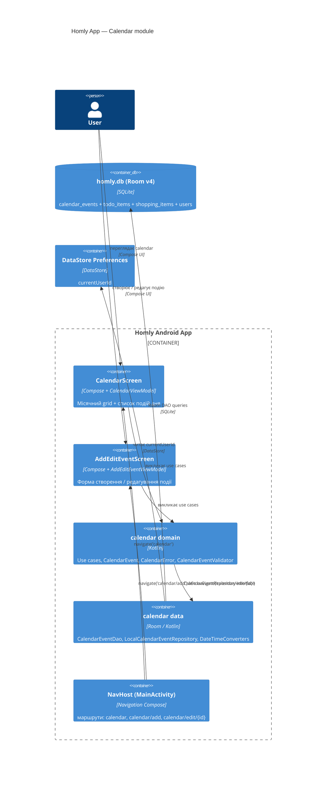
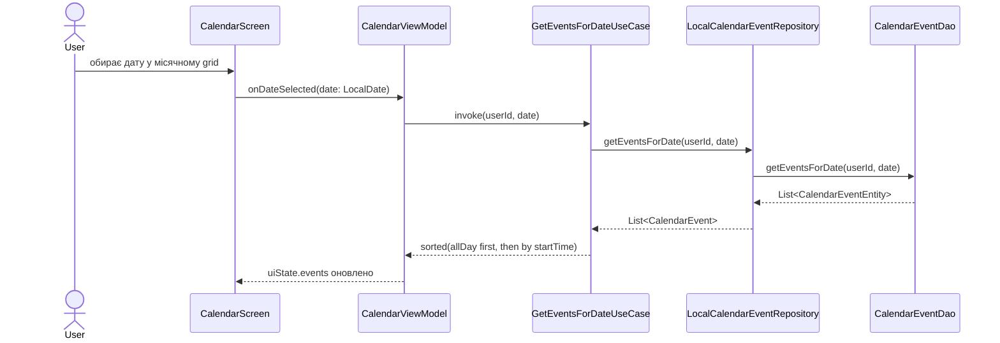
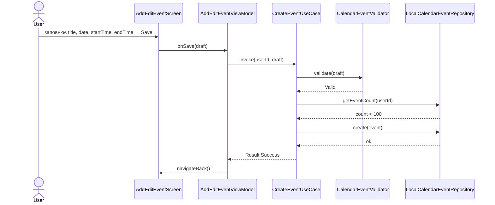
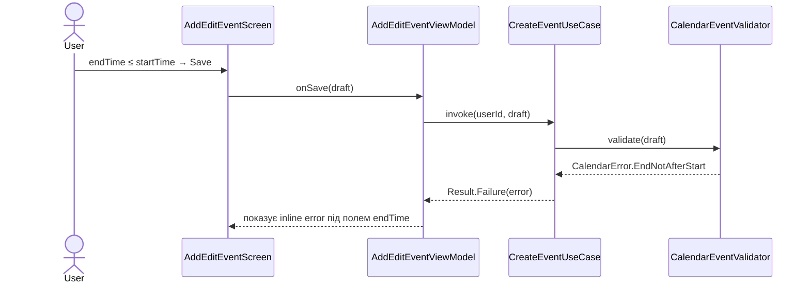
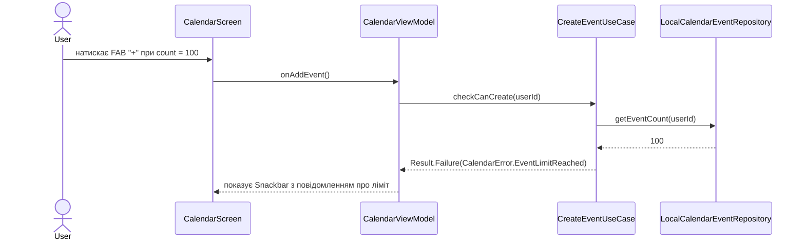

# Software Architecture Document — calendar (Events)

<!-- Stages 04-05 → see sdlc/plugin/skills/architecture-design/SKILL.md -->
<!-- 12 Arc42 sections. Empty sections — <!-- N/A: <one-line reason> -->. -->
<!-- C4 Context (L1) lives inline in §3. C4 Container (L2) lives inline in §5. -->

## 1. Introduction and goals

**Intent.** Модуль calendar дозволяє кожному члену сім'ї створювати timed та all-day події і переглядати їх у місячному calendar-view із щоденним списком подій. У поточній ітерації події прив'язані до конкретного `user` (per-user); спільний сімейний доступ — у наступній фазі (family-модуль). Модуль є одним із чотирьох рівноцінних модулів прототипу (events, todo, shopping, family). *(PRD §2, §1, idea-brief §7)*

**Top-3 quality goals (1-liners; full scenarios in §10):**

1. **Data isolation** — кожен запит до сховища фільтрує події виключно за `userId` авторизованого користувача; жодне поле іншого користувача не повертається *(PRD §6.1, AC-10)*
2. **Domain integrity** — всі domain-invariants (MAX_EVENTS=100, endTime > startTime, title непорожній і ≤100 символів) перевіряються у domain-шарі до будь-якого запису *(PRD §8, AC-07, AC-07b, AC-08, AC-09)*
3. **Calendar correctness** — після вибору дня all-day події відображаються першими, timed — відсортовані за startTime ascending *(AC-01, AC-03, AC-04)*

**Stakeholders.**

| Role | Interest | Sign-off owner? |
|---|---|---|
| user | створює і переглядає власні події | No |
| Tech Lead | review SAD + code | Yes |
| Security Lead | review data-isolation + injection risks | No |

## 2. Constraints

**Technical.**
- Kotlin 2.2.10 + Coroutines
- Android SDK: Min **29** (Android 10) / Target+Compile 36 (Android 15) *(підняли з 24 — ADR-0003)*
- AGP 9.2.1 · KSP 2.2.10-2.0.2
- Jetpack Compose BOM 2026.02.01 + Material3
- Room 2.7.1 (KSP-generated DAOs) — HomlyDatabase version 3→**4** (нова таблиця `calendar_events`)
- Navigation Compose 2.9.0
- DataStore Preferences 1.1.4 (сесія/userId)
- Без DI-фреймворку — manual wiring через `AppContainer` (`HomlyApplication.kt`)

**Organisational.**
- Effort: ~1 person-week (solo, Alex)
- Prototype — NFRs deferred; немає Production SLA

**Conventions.**
- CLAUDE.md: Kotlin official code style, 4-space indent, один Composable-екран = один файл
- ARCHITECTURE.md: feature/presentation/domain/data layout; MVVM + StateFlow; Compose-only (no XML)
- Усі нові залежності — через `gradle/libs.versions.toml`

**Regulatory / external.**
- Дані класифіковані як internal (PRD §6.1): event title може містити особисту інформацію (медичні записи)
- Без нових auth-меж; Room parameterized queries запобігають SQL injection
- Локальна БД — без мережі, без cloud sync у цій ітерації

## 3. Context and scope

<!-- brownfield: calendar package is new; app shell (auth, todo, shopping) already exists -->

Модуль calendar — частина локального Android-застосунку Homly. User переглядає місячний grid, обирає день, бачить список подій дня, і може створювати / редагувати / видаляти власні timed або all-day події. У цій ітерації немає зовнішніх систем: немає backend-сервера, push-сервісу, синхронізації з Google Calendar — застосунок повністю offline-first.

**External systems (in / out):**

| Actor or system | Type | Interaction |
|---|---|---|
| user | Person (internal) | Переглядає і редагує власні події через Compose UI |

*(Жодних зовнішніх систем у цій ітерації — PRD §3 Non-goals)*

**C4 Context (L1):**



## 4. Solution strategy

**SC-1: Follow existing MVVM feature module pattern** — нова папка `calendar/` зі стандартним layout `presentation/domain/data`, manual wiring через `AppContainer`. Відхилення не потрібне: idea-brief §8 фіксує «events структурно ідентичні todo+shopping плюс datetime-поля». *(inline — конвенція ARCHITECTURE.md)*

**SC-2: Розширити `HomlyDatabase` з явною Migration(3→4)** — таблиця `calendar_events` додається до єдиної Room-бази; version bump 3→4 через `Migration(3, 4)` з `CREATE TABLE`. Альтернатива `fallbackToDestructiveMigration` відхилена — втрата todo/shopping-даних неприйнятна навіть для прототипу. *(→ ADR-0001)*

**SC-3: Enforce per-user filtering at DAO level** — кожен DAO-метод на читання містить `WHERE userId = :userId`. Defense in depth: security-invariant не залежить від коректності use-case. Узгоджено з паттерном `TodoItemEntity`/`ShoppingItemEntity`. *(→ ADR-0002)*

## 5. Building block view

Layered MVVM (Clean Architecture) — той самий стиль, що `todolist/` і `shopping/`. Domain layer — pure Kotlin без Android SDK; presentation — Compose + ViewModel зі `StateFlow`; data — Room DAO + Repository. Дати і час представлені через `java.time.LocalDate` / `LocalTime` нативно (minSdk 29, ADR-0003) — без `coreLibraryDesugaring`.

**Структура пакетів:**

```
com.dgero.homly/calendar/
├── presentation/
│   ├── CalendarScreen.kt          # місячний grid (верхня частина) + список подій дня (нижня); FAB (+)
│   ├── CalendarViewModel.kt
│   ├── AddEditEventScreen.kt      # форма create/edit (eventId: Long? = null)
│   └── AddEditEventViewModel.kt
├── domain/
│   ├── model/
│   │   └── CalendarEvent.kt       # id, userId, title, date: LocalDate, isAllDay, startTime: LocalTime?, endTime: LocalTime?
│   ├── repository/
│   │   └── CalendarEventRepository.kt  (interface)
│   ├── usecase/
│   │   ├── GetEventsForMonthUseCase.kt
│   │   ├── GetEventsForDateUseCase.kt
│   │   ├── CreateEventUseCase.kt
│   │   ├── UpdateEventUseCase.kt
│   │   └── DeleteEventUseCase.kt
│   ├── error/
│   │   └── CalendarError.kt       # sealed class: EmptyTitle | TitleTooLong | EndNotAfterStart | EventLimitReached
│   └── validation/
│       └── CalendarEventValidator.kt
└── data/
    ├── local/
    │   ├── CalendarEventEntity.kt  # Room entity — таблиця calendar_events; TypeConverters для LocalDate/LocalTime
    │   ├── CalendarEventDao.kt     # @Query з WHERE userId = :userId (ADR-0002)
    │   └── DateTimeConverters.kt   # @TypeConverter: LocalDate↔Long (epochDay), LocalTime↔Int (secondOfDay)
    └── repository/
        └── LocalCalendarEventRepository.kt
```

**C4 Container (L2):**



## 6. Runtime view

**Flow 1: Переглянути події дня**



**Flow 2: Створити timed event (happy path)**



**Flow 3: Збій валідації (endTime ≤ startTime)**



**Flow 4: Ліміт подій вичерпано (MAX_EVENTS = 100)**



## 7. Deployment view

Застосунок — єдиний Android-процес (`com.dgero.homly`), встановлений на пристрій користувача. Немає backend-сервера, хмарної інфраструктури чи окремих сервісів — calendar module виконується в тому самому процесі, що і todo/shopping/auth. Дані зберігаються локально в Room DB (`homly.db`) на internal storage пристрою.

**Monitoring:** <!-- N/A: прототип без crash-репортингу і аналітики -->

**Scaling thresholds:** <!-- N/A: 2–6 членів сім'ї, локальна SQLite, MAX_EVENTS=100 -->

**Deployment topology:** single APK, один пристрій на user.

## 8. Crosscutting concepts

| Concept | Convention | Where defined |
|---|---|---|
| Auth / Session | `DataStoreSessionRepository.currentUserId` — передається у use cases; DAO фільтрує за ним | auth module (ADR-0002) |
| Error handling | `sealed class CalendarError` у `domain/error/`; ViewModel маппить у UI state | per todolist pattern |
| Validation | `CalendarEventValidator` у `domain/validation/`; повертає `CalendarError` | per todolist pattern |
| ID strategy | Room `@PrimaryKey(autoGenerate = true)` — Long; нові ID генерує DB | existing entity pattern |
| Domain limits | `object CalendarLimits { const val MAX_EVENTS = 100 }` у `domain/` | PRD §8 |
| State management | `StateFlow` у ViewModel; `collectAsStateWithLifecycle()` у Composable | ARCHITECTURE.md |
| Persistence | Room TypeConverters для `LocalDate`↔`Long` (epochDay) і `LocalTime`↔`Int` (secondOfDay) у `DateTimeConverters.kt` | §5 SAD (ADR-0003) |
| Logging | <!-- N/A: прототип, без structured logging --> | — |
| Internationalization | <!-- N/A: UI-рядки захардкоджені українською --> | — |
| Observability | <!-- N/A: прототип --> | — |

## 9. Architecture decisions

<!-- TBD — auto-populated during Socratic pass as ADRs spawn -->

| # | Title | Status | Section |
|---|---|---|---|
| 0001 | Use proper Room Migration for calendar_events schema change | Accepted | §4 |
| 0002 | Enforce per-user event filtering at DAO level | Accepted | §4 |
| 0003 | Raise minSdk to 29 for native java.time support | Accepted | §2, §5 |

## 10. Quality requirements

*(Числові NFR не задані — PRD §6 «N/A — prototype». Сценарії виведені з QG §1 + AC PRD §5.)*

**QG-1. Data isolation** *(AC-10, PRD §6.1)*

- **When:** у Room DB є події двох різних `userId`; авторизований `currentUserId = 1`
- **Then:** `CalendarEventDao.getEventsForDate(userId=1, date)` повертає лише рядки з `userId=1`; жоден рядок з `userId=2` не з'являється
- **How verify:** unit-тест `CalendarEventDaoTest` — insert подій двох userId, перевірити що query повертає виключно рядки першого

**QG-2. Domain integrity** *(AC-07, AC-07b, AC-08, AC-09)*

- **When:** `CalendarEventValidator.validate()` отримує чернетку з порушеним інваріантом (порожній title / title >100 символів / endTime ≤ startTime / кількість подій = 100 і спроба create)
- **Then:** validator повертає відповідний `CalendarError`; жоден запис не пишеться у Room DB
- **How verify:** unit-тести `CalendarEventValidatorTest` — по одному тесту на кожен `CalendarError` variant

**QG-3. Calendar correctness** *(AC-01, AC-03, AC-04)*

- **When:** `GetEventsForDateUseCase` отримує мікс з all-day і timed подій різного startTime
- **Then:** результуючий список містить all-day першими, потім timed у порядку зростання startTime
- **How verify:** unit-тест `GetEventsForDateUseCaseTest` зі stub-репозиторієм і перевіркою порядку елементів у списку

## 11. Risks and technical debt

| Risk / debt | Severity | Mitigation | Owner |
|---|---|---|---|
| `fallbackToDestructiveMigration` залишається активним — при помилці у Migration(3→4) Room знищить всі дані | Medium | Покрити Migration(3→4) unit-тестом (`MigrationTest`); перевіряти schema перед релізом | Alex |
| Спільний сімейний доступ до подій (family sharing) відсутній у v1 — per-user only | Low | Accepted by design (PRD §3); буде у family-module фазі | Alex |
| minSdk 29 відсікає Android 7–9 (API 24–28) | Low | Accepted for prototype (ADR-0003); переглянути при виході за межі prototype | Alex |
| Рядки UI захардкоджені українською — без string resources | Low | Acceptable for prototype; extraction до `strings.xml` перед production | Alex |

**Accepted debt (acceptable in v1, plan to fix later):**
- Відсутній crash-репортинг і аналітика (prototype)
- Рядки не у `strings.xml` (prototype; потрібно перед internationalisation)
- Відсутні recurring events і reminders (PRD §3 Non-goals)

## 12. Glossary

*(Базові терміни — з `docs/features/calendar/CONTEXT.md`. Технічні терміни — додані в рамках цього SAD.)*

| Term | Meaning |
|---|---|
| event | Запланована подія, що або відбувається у визначені часові межі, або триває цілий день *(CONTEXT.md)* |
| all-day event | Подія без конкретного часу початку і кінця, займає весь день *(CONTEXT.md)* |
| timed event | Подія з явно заданим часом початку і кінця в межах одного дня *(CONTEXT.md)* |
| user | Окрема людина — член family з власним профілем у застосунку *(CONTEXT.md)* |
| family | Група людей зі спільним доступом до подій один одного; shared-доступ — у наступній фазі *(CONTEXT.md)* |
| CalendarError | `sealed class` у `domain/error/`: EmptyTitle / TitleTooLong / EndNotAfterStart / EventLimitReached |
| CalendarLimits | `object` у `domain/` з `const val MAX_EVENTS = 100` (PRD §8, resolved 2026-06-28) |
| DateTimeConverters | Room `@TypeConverter` клас: `LocalDate` ↔ `Long` (epochDay), `LocalTime` ↔ `Int` (secondOfDay) |
| Migration(3→4) | Явна Room DB міграція — `CREATE TABLE calendar_events (...)` при version bump 3→4 (ADR-0001) |
