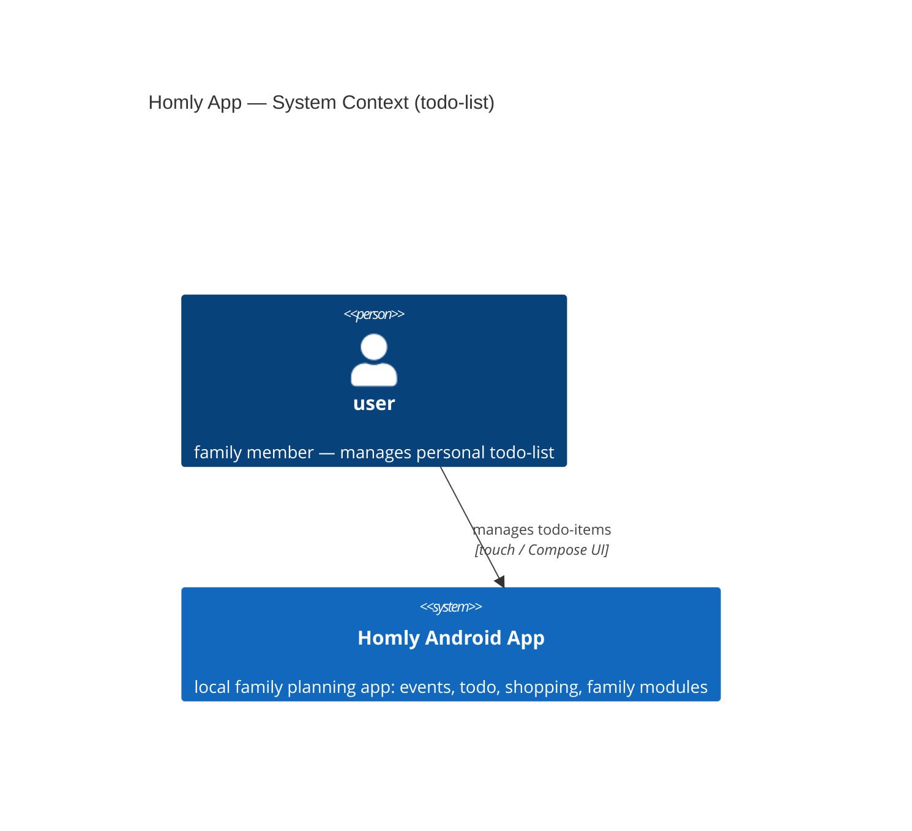

# Software Architecture Document — todo-list (mcp-init)

<!-- Stages 04-05 → see sdlc/plugin/skills/architecture-design/SKILL.md -->
<!-- 12 Arc42 sections. Empty sections — <!-- N/A: <one-line reason> -->. -->
<!-- C4 Context (L1) lives inline in §3. C4 Container (L2) lives inline in §5. -->

## 1. Introduction and goals

**Intent.** Family members currently store todo-items in Telegram chats and the coordinator's memory. The todo-list feature gives every user in the family app a structured, private task list with "done" status — removing Telegram as the coordination medium. In v1 the list is per-user; family-shared access is deferred to the family module.

**Top-3 quality goals (1-liners; full scenarios in §10):**

1. **Data integrity** — the ≤50-item limit is enforced atomically; no partial write leaves the list in an inconsistent state.
2. **Authorization correctness** — a user can only read and modify their own todo-items; the system must not reveal the existence of another user's items (AC-10).
3. **Architectural conformance** — the todo module follows the project's MVVM + Clean Architecture layering (presentation / domain / data) with no layer violations.

**Stakeholders.**

| Role | Interest | Sign-off owner? |
|---|---|---|
| user | manages personal todo-list, primary beneficiary | No |
| Tech Lead | SAD approval, architecture review | Yes |
| Alex | decision owner, implements feature | No |

## 2. Constraints

**Technical.**
- Kotlin + Jetpack Compose (Material3)
- Android SDK: min 24, target/compile 36
- Room 2.7.1 (SQLite persistence)
- DataStore 1.1.4 (encrypted session / userId)
- Coroutines + Flow/StateFlow
- Architecture convention: MVVM + Clean Architecture (CLAUDE.md)

**Organisational.**
- 1 developer (Alex); no hard deadline — prototype
- Target scale: 1 family group, 2–6 users

**Conventions.**
- CLAUDE.md: Compose-only, 4-space indent, one composable per screen file
- Error handling: sealed class (mirror shopping module: `EmptyName`, `NameTooLong`, `LimitReached`)
- `MAX_ITEMS = 50`, `MAX_NAME_LENGTH = 100` (confirmed in PRD §1 + §8)
- `TransactionRunner` for atomic add-with-limit check

**Regulatory / external.**
- Data classification: internal — personal task titles, not public
- No GDPR/SOC2 scope (single-family prototype)
- SQLite injection mitigated by Room parameterized queries (PRD §6.1)

## 3. Context and scope

The todo-list feature is one of four core modules (events, todo, shopping, family) in the Homly family planning app. Each family member manages a private, per-user list of tasks with "done" status — replacing ad-hoc Telegram coordination. In v1, all data is local to the device (Room SQLite); cross-user sharing and a remote backend are deferred to later iterations.

**External systems (in / out):**

| Actor or system | Type | Interaction |
|---|---|---|
| user | Person | creates, views, edits, deletes own todo-items |

*(No external systems in v1 — all state lives in local Room SQLite. A remote backend is a planned addition in a later iteration.)*

**C4 Context (L1):**

## 4. Solution strategy

_to be filled_

## 5. Building block view

_to be filled_

## 6. Runtime view

_to be filled_

## 7. Deployment view

_to be filled_

## 8. Crosscutting concepts

_to be filled_

## 9. Architecture decisions

| # | Title | Status | Section |
|---|---|---|---|

ADR files live under `docs/features/mcp-init/todo-list/adr/NNNN-<title>.md`.

## 10. Quality requirements

_to be filled_

## 11. Risks and technical debt

| Risk / debt | Severity | Mitigation | Owner |
|---|---|---|---|

**Accepted debt (acceptable in v1, plan to fix later):**
_to be filled_

## 12. Glossary

| Term | Meaning |
|---|---|
