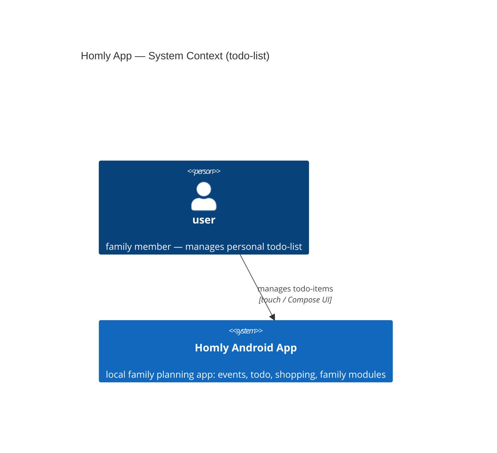
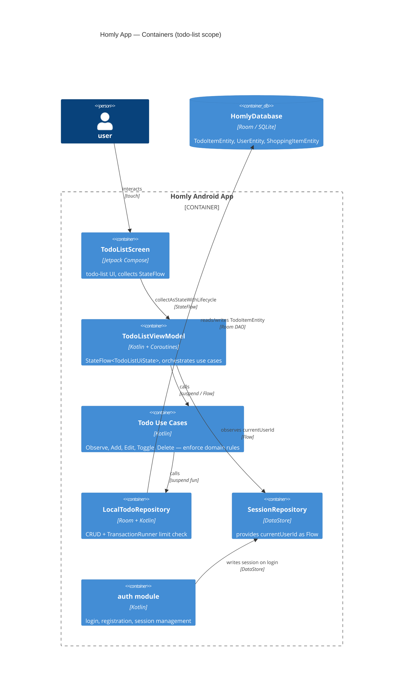
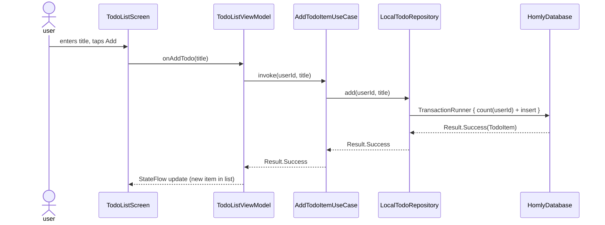

# Software Architecture Document — todo-list (mcp-init)

<!-- Stages 04-05 → see sdlc/plugin/skills/architecture-design/SKILL.md -->
<!-- 12 Arc42 sections. Empty sections — <!-- N/A: <one-line reason> -->. -->
<!-- C4 Context (L1) lives inline in §3. C4 Container (L2) lives inline in §5. -->

## 1. Introduction and goals

**Decision overrides.**
- F1 (§6 userId step omitted from sequence diagram) — overridden by author, rationale: shopping module pattern is identical — ViewModel holds `currentUserId: StateFlow<Long?>` collected once from SessionRepository at startup; `onAdd()` reads `.value` without a new call. The C4 Container diagram (§5) already shows `Rel(vm, session, "observes currentUserId", "Flow")`. Adding a per-action step in §6 would misrepresent the runtime model.

**Intent.** Family members currently store todo-items in Telegram chats and the coordinator's memory. The todo-list feature gives every user in the family app a structured, private task list with "done" status — removing Telegram as the coordination medium. In v1 the list is per-user; family-shared access is deferred to the family module.

**Top-3 quality goals (1-liners; full scenarios in §10):**

1. **Data integrity** — the ≤50-item limit is enforced atomically; no partial write leaves the list in an inconsistent state.
2. **Authorization correctness** — a user can only read and modify their own todo-items; the system must not reveal the existence of another user's items (AC-10).
3. **Architectural conformance** — the todo module follows the project's MVVM + Clean Architecture layering (presentation / domain / data) with no layer violations.

**Stakeholders.**

| Role | Interest | Sign-off owner? |
|---|---|---|
| user | manages personal todo-list, primary beneficiary | No |
| Tech Lead | SAD approval, architecture review | Yes |
| Alex | decision owner, implements feature | No |

## 2. Constraints

**Technical.**
- Kotlin + Jetpack Compose (Material3)
- Android SDK: min 24, target/compile 36
- Room 2.7.1 (SQLite persistence)
- DataStore 1.1.4 (encrypted session / userId)
- Coroutines + Flow/StateFlow
- Architecture convention: MVVM + Clean Architecture (CLAUDE.md)

**Organisational.**
- 1 developer (Alex); no hard deadline — prototype
- Target scale: 1 family group, 2–6 users

**Conventions.**
- CLAUDE.md: Compose-only, 4-space indent, one composable per screen file
- Error handling: sealed class (mirror shopping module: `EmptyName`, `NameTooLong`, `LimitReached`)
- `MAX_ITEMS = 50`, `MAX_NAME_LENGTH = 100` (confirmed in PRD §1 + §8)
- `TransactionRunner` for atomic add-with-limit check

**Regulatory / external.**
- Data classification: internal — personal task titles, not public
- No GDPR/SOC2 scope (single-family prototype)
- SQLite injection mitigated by Room parameterized queries (PRD §6.1)

## 3. Context and scope

The todo-list feature is one of four core modules (events, todo, shopping, family) in the Homly family planning app. Each family member manages a private, per-user list of tasks with "done" status — replacing ad-hoc Telegram coordination. In v1, all data is local to the device (Room SQLite); cross-user sharing and a remote backend are deferred to later iterations.

**External systems (in / out):**

| Actor or system | Type | Interaction |
|---|---|---|
| user | Person | creates, views, edits, deletes own todo-items |

*(No external systems in v1 — all state lives in local Room SQLite. A remote backend is a planned addition in a later iteration.)*

**C4 Context (L1):**



## 4. Solution strategy

**Top-3 strategic choices (seeds for ADRs):**

1. **Sealed-class error model + `TransactionRunner` for limit enforcement** — `TodoError` sealed class (`EmptyName`, `NameTooLong`, `LimitReached`, `Unauthorized`) paired with `TransactionRunner` to atomically check the ≤50-item limit and insert in one DB transaction. Gives a clear domain contract and prevents partial-write inconsistencies. *(→ ADR-0001)*

2. **Per-user data isolation at the DAO layer** — every Room DAO query takes `userId` as a parameter; the ViewModel always sources `userId` from `SessionRepository.currentUserId`. This makes it structurally impossible to accidentally read another user's items, satisfying QG-2 (authorization correctness). The alternative — filtering in the domain service — leaves the DAO "open" and shifts authz responsibility upward. *(→ ADR-0002)*

3. **Lazy sort (deferred reorder on list-open)** — done items are moved to the bottom of the list when the list is opened, not immediately on toggle. Implemented as `ORDER BY isDone ASC, createdAt DESC` in the DAO query — natural SQL sort with no additional in-memory logic. Matches PRD AC-03 exactly.

Each tactical decision in later sections traces to one of these choices. Decisions that contradict a strategic choice are red flags — surfaced in §11 Risks.

## 5. Building block view

The todo-list module is a new vertical slice inside the existing Homly monolith, following the same MVVM + Clean Architecture layering as the shopping module. Presentation collects from ViewModel; ViewModel orchestrates use cases; domain defines `TodoItem`, `TodoError`, and `TodoRepository` interface; data implements the repository via Room DAO. This is the established project convention (CLAUDE.md). *(→ ADR-0003)*

**Internal decomposition:**

```
com.dgero.homly/todo-list/
├── domain/
│   ├── model/          TodoItem.kt
│   └── error/          TodoError.kt  (sealed: EmptyName, NameTooLong, LimitReached, Unauthorized)
├── domain/repository/  TodoRepository.kt  (interface)
├── domain/usecase/
│   ├── ObserveTodoItemsUseCase.kt
│   ├── AddTodoItemUseCase.kt
│   ├── EditTodoItemUseCase.kt
│   ├── ToggleTodoItemUseCase.kt
│   └── DeleteTodoItemUseCase.kt
├── data/
│   ├── db/             TodoItemEntity.kt, TodoItemDao.kt
│   └── repo/           LocalTodoRepository.kt
└── presentation/
    ├── TodoListScreen.kt
    └── TodoListViewModel.kt
```

*(Kotlin package: `com.dgero.homly.todolist` — hyphens are not valid in package names.)*

**C4 Container (L2):**



## 6. Runtime view

**Critical flow: Add todo-item (happy path)**



*Failure modes (inline, not diagrammed — flows are simple):*
- **LimitReached**: `TransactionRunner` sees count ≥ 50 → returns `TodoError.LimitReached` → UI shows error.
- **Unauthorized** (toggle/edit/delete): DAO `WHERE userId=:userId` matches 0 rows → returns `TodoError.Unauthorized` → UI silently ignores per AC-10.
- **EmptyName / NameTooLong**: validated in `AddTodoItemUseCase` before DB call → returns `TodoError.EmptyName` / `TodoError.NameTooLong` → UI shows error.

## 7. Deployment view

<!-- N/A: Android single-device app; all state is local (Room SQLite + DataStore); todo-list feature adds no new deployment unit, process, or external dependency. Monitoring and crash reporting are out of scope for the v1 prototype. -->

## 8. Crosscutting concepts

| Concept | Convention | Where defined |
|---|---|---|
| Auth / session | `currentUserId` via `SessionRepository` (DataStore) | auth module (existing) |
| Error handling | Sealed `TodoError` per `Result<T>` wrapper | ADR-0001 + todo `domain/error/` |
| Data isolation | `userId` parameter in every DAO query | ADR-0002 + todo `data/db/` |
| Concurrency | Coroutines + Flow; `collectAsStateWithLifecycle` in Screen | CLAUDE.md + §2 constraints |
| ID strategy | Room auto-generated `Long` PK (consistent with shopping module) | shopping module pattern |
| Observability | N/A — prototype, no crash reporting or analytics in v1 | — |
| Internationalisation | N/A — single-language prototype | — |

## 9. Architecture decisions

| # | Title | Status | Section |
|---|---|---|---|
| 0001 | Use sealed TodoError and TransactionRunner for domain validation | Accepted | §4 |
| 0002 | Enforce per-user isolation at the DAO layer | Accepted | §4 |
| 0003 | Create standalone todo-list module | Accepted | §5 |

ADR files live under `docs/features/mcp-init/todo-list/adr/NNNN-<title>.md`.

## 10. Quality requirements

**QG-1. Data integrity — ≤50-item limit**
- **When:** user attempts to add a 51st todo-item
- **Then:** system returns `TodoError.LimitReached`; no row written to DB; count remains ≤ 50 (AC-11; PRD §6 NFR)
- **How verify:** `AndroidTest: addItem_whenAtLimit_returnsLimitReached()` — add 50 items, assert 51st call returns `Result.Failure(TodoError.LimitReached)`, verify DB count = 50

**QG-2. Authorization correctness — cross-user access denied**
- **When:** authenticated user A calls toggle/edit/delete on an `itemId` owned by user B
- **Then:** returns `Result.Failure(TodoError.Unauthorized)`; does not reveal item existence; DB unchanged (AC-10)
- **How verify:** unit test on `ToggleTodoItemUseCase` with mismatched `userId` — assert `Failure(TodoError.Unauthorized)` and DB row unchanged

**QG-3. Architectural conformance — MVVM + Clean Architecture**
- **When:** a developer reads `com.dgero.homly.todolist/` source
- **Then:** package structure matches §5 (domain / data / presentation); no cross-layer imports; ViewModel exposes `StateFlow<TodoListUiState>`; sealed `TodoError` used in all error paths
- **How verify:** PR code review checklist — check layer imports; verify `TodoListViewModel` returns `StateFlow`; confirm all error branches use `TodoError` variants

## 11. Risks and technical debt

| Risk / debt | Severity | Mitigation | Owner |
|---|---|---|---|
| HomlyDatabase uses destructive migration — a schema error in any module wipes all local data including todo-items | Medium | Pin DB version before each release; add Room migration tests to CI before schema changes | Alex |
| Local-only storage (no backup) — if device is wiped or replaced, all todo-items are permanently lost | Medium | Document as v1 limitation; add export/backup/sync in a future iteration when remote backend is added | Alex |
| Room DB durability (PRD §8 open question) — does Room guarantee writes survive process death? | Low | Resolved: Room/SQLite is ACID-compliant — committed writes survive process death without additional measures | Alex |

**Accepted debt (acceptable in v1, plan to fix later):**
- Single-device local-only storage: no synchronisation or backup; remote backend deferred to a later iteration (noted in §3).

## 12. Glossary

| Term | Meaning |
|---|---|
| todo-item | справа, яку потрібно виконати (CONTEXT.md) |
| user | окрема людина, що є членом family та має власний профіль у застосунку (CONTEXT.md) |
| family | група людей зі спільним доступом до todo-items, shopping-list та подій (CONTEXT.md) |
| TodoError | sealed class з варіантами `EmptyName`, `NameTooLong`, `LimitReached`, `Unauthorized` — домен-контракт для всіх помилок todo-list |
| TransactionRunner | абстракція над `db.withTransaction {}` — атомарна перевірка ліміту + вставка в одній Room-транзакції |
| LimitReached | варіант `TodoError` — спрацьовує коли список досяг MAX_ITEMS = 50 |
| HomlyDatabase | Room SQLite singleton, спільна для всіх модулів (auth, shopping, todo-list) |
| StateFlow&lt;TodoListUiState&gt; | реактивний стан VM; Screen підписується через `collectAsStateWithLifecycle` |
